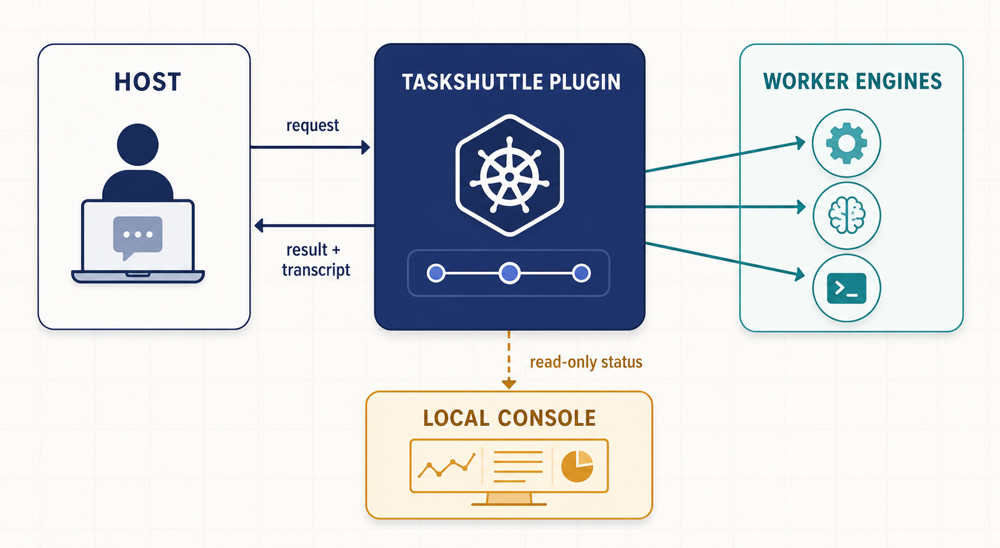

# TaskShuttle

[English](README.md) | 简体中文

TaskShuttle 让你正在使用的 coding agent 把一小段有边界的工作交给另一个
coding agent。你始终留在同一段对话里：指定 worker、描述任务，然后收到结果和
完整 transcript。



由你决定委派什么，以及结果是否足够好。TaskShuttle 负责交接、展示进度，让你
可以为每项工作选择合适的 coding agent。

`0.1.0` · Node.js 22+ · macOS · 首个公开版本

## 快速开始

### 1. 安装 TaskShuttle

最简单的方式是构建 plugin，并安装本机能找到的所有 host 集成：

```bash
git clone <your-taskshuttle-repository>
cd taskshuttle
pnpm install
pnpm check
pnpm run deploy --scope user
```

`pnpm run deploy --scope user` 会安装共享的 `taskshuttle-launch` 命令；如果本机
存在 Codex、Claude Code 或 OpenCode CLI，也会安装或更新相应集成。如果本机存在
Kimi，则会在完成一次会话内 bootstrap 后同步 Kimi；否则会打印 bootstrap 命令供你
执行。运行前请至少安装并登录一个 host CLI。部署后重启 host（或 reload 它的
plugin）。

#### 只安装一个 host

如果不想配置所有 host，可以先构建并安装共享 launcher，再只运行需要的 host
命令：

```bash
pnpm install
pnpm check
npm pack --pack-destination release ./packages/plugin
npm install -g ./release/taskshuttle-$(node -p "require('./packages/plugin/package.json').version").tgz
```

在仓库根目录运行对应的命令块：

```bash
# Codex
codex plugin marketplace add "$PWD/marketplaces/codex"
codex plugin add taskshuttle@taskshuttle
```

```bash
# Claude Code
claude plugin marketplace add "$PWD/marketplaces/claude-code"
claude plugin install taskshuttle@taskshuttle --scope user -y
```

对于 OpenCode，把下面的内容加入 `~/.config/opencode/opencode.json` 的 `mcp`，
然后重启 OpenCode：

```json
{
  "taskshuttle": {
    "type": "local",
    "command": ["taskshuttle-launch"]
  }
}
```

Kimi 还需要两个额外步骤。先在要工作的项目目录中，用显式项目目录启动：

```bash
cd /path/to/your/project
TASKSHUTTLE_HOST_CWD="$PWD" kimi
```

这种启动方式可以避开 Kimi 托管 plugin 的工作目录权限问题。在 Kimi 会话中
首次安装 plugin，然后 reload：

```text
/plugins install /absolute/path/to/taskshuttle/hosts/kimi
/reload
```

当 Kimi host 的项目就是本仓库时，必须使用显式的
`TASKSHUTTLE_HOST_CWD="$PWD" kimi`；对其他项目使用它也没有问题。

### 2. 让另一个 engine 工作

在你正在使用的 host 中像平时一样输入 prompt。说清楚 worker、工作范围和完成
标准：

```text
Use codex to add a regression test for the empty-input case in parse(), run the relevant tests, and report the files you changed.
```

无需打开另一个窗口，就能让另一个 worker review：

```text
Have claude-code review Codex's changes and fix only the issues it finds.
```

### 3. 打开 console

host 会话启动时就会初始化 TaskShuttle。要查看 worker 的工作进度，可以对 host
agent 说：

```text
Open the TaskShuttle console for this project.
```

也可以直接运行 launcher：

```bash
taskshuttle console open
```

浏览器页面会显示正在运行的 worker、任务、问题、状态变化和 transcript 输出。
它只在本机提供只读视图。如果是自定义安装，请确认
`~/.taskshuttle/config.json` 中的 `console.enabled` 为 `true`，然后重启 host
会话。

## 可以构建什么

使用 TaskShuttle，你可以：

- 让一个 worker 实现改动，另一个 worker review；
- 让不同 engine 并行调查问题或运行独立测试；
- 在一个对话里持续工作，同时让任务在后台运行；
- 为每项任务指定项目目录、文件范围和验收标准；
- 需要核对时回看 worker 的 transcript；
- 为常用 worker 建立可复用的项目默认配置。

TaskShuttle 不管理 Git 分支或 worktree。如果多个 worker 共用一个目录，请在
prompt 中划分文件所有权，或给它们不同目录。

## 为什么选择 TaskShuttle？

请第二个 coding agent 帮忙，通常意味着打开另一个窗口、重新解释上下文，再把
答案复制回来。TaskShuttle 把这段交接留在一个地方：

- **留在一个对话里。** 结果回到你已经熟悉的 agent。
- **选择合适的 worker。** 按任务选择 Codex、Claude Code、OpenCode、Kimi 或 pi。
- **保留完整过程。** worker 输出会以 transcript 保留下来。
- **看得见进度。** 本地 console 显示等待、问题和完成状态。
- **决定是否接受。** 任务、worker 和结果是否合格，都由你决定。

TaskShuttle 不会替你给 worker 的答案打分。

## 支持的 Host 与 Worker

一个 engine 有两种使用方式：

- **host** 是安装 TaskShuttle、你与之对话的 coding agent；
- **worker** 是接收委派任务的 coding agent。

### Host

| Host | 安装方式 | 作用域 |
| --- | --- | --- |
| Codex | 本地 marketplace plugin | user、project |
| Claude Code | 本地 marketplace plugin | user、project、local |
| OpenCode | `opencode.json` MCP 配置 | user、project |
| Kimi | 会话内安装 plugin | user |

Codex、Claude Code、OpenCode 和 Kimi 都可以作为 TaskShuttle host。Kimi 需要
Quickstart 中的特殊启动命令。

### Worker

| Worker | 可以作为 host？ |
| --- | --- |
| Codex | 可以 |
| Claude Code | 可以 |
| OpenCode | 可以 |
| Kimi | 可以 |
| pi | 仅 worker |

Worker 是否可用取决于本机安装并登录了哪些 CLI。让 host agent 运行
`workers_list`，即可查看当前可用的 worker。

### 增加 host

要让另一个 coding-agent shell 也能使用 TaskShuttle，请按[增加 host](docs/host-extension.md)
中的 contributor 清单添加集成。文档覆盖 host manifest、安装命令、验证、安全边界
和 release 检查。

## 架构

整体路径很简单：host 把请求交给 TaskShuttle，TaskShuttle 协调一个指定的 worker，
结果和 transcript 回到你的对话。console 观察同一份工作，但不会改变它。

组件边界、启动行为、状态流、存储和安全模型见[架构参考](docs/architecture.md)。
请求与响应的确切形状见[工具契约](docs/tool-schemas.json)。

## 文档

### 用户

- [委派 worker](skills/delegate-workers/SKILL.md) — 让 host agent 委派有边界的工作，
  含默认 worker profile 与如何把上下文交给 worker。
- [架构参考](docs/architecture.md) — 组件边界、console、安全模型。
- [工具契约](docs/tool-schemas.json) — 全部 20 个工具的输入与输出。

### Contributor

- [架构参考](docs/architecture.md) — 对外边界图。
- [Host 扩展指南](docs/host-extension.md) — 增加并验证 host。
- [CONTRIBUTING.md](CONTRIBUTING.md) — 变更如何进来、代码里的标识符是什么意思、以哪套 CI 为准。
- [SECURITY.md](SECURITY.md) — 本软件实施的边界、每条边界的理由，以及什么不在范围内。

冻结规格、详细设计、test plan 和决策记录属于维护者，不对外发布。代码注释按编号引用它们；
CONTRIBUTING.md 说明了这对读者意味着什么。

## 局限

- TaskShuttle 不选择任务、不拆分工作、不自动选择 worker，也不判断 review 是否完成。
- 它不管理 Git 分支/worktree，也不提供 OS sandbox。
- Worker 不会自动共享上下文；请在 prompt 中传递需要的文件、笔记或上一个结果。
- Console 只在本地提供只读视图。Host 会话运行期间，能访问 loopback 端口的人都能读取页面。

## 贡献

需要 Node.js 22+ 和 pnpm 9.15.9。修改后运行完整检查：

```bash
pnpm check
```

必须先 build 再 test，因为 artifact 和 host 检查读取生成的 bundle。若修改影响
工具行为、调度、安全边界或支持声明，需要先记录决策再实现——见
[CONTRIBUTING.md](CONTRIBUTING.md)。
